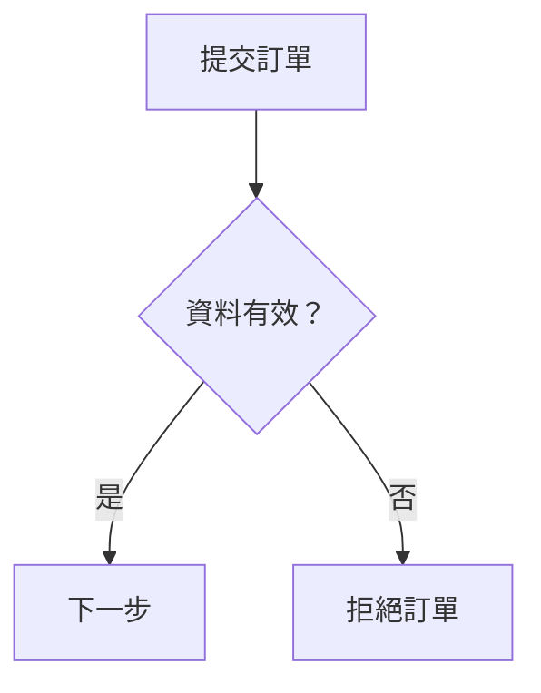

# 第 4 章　Mermaid：把流程直接寫進文件

> 樣章草稿。配套範例已在本機渲染；不代表所有 Markdown 平台皆已測試。本章的支付流程是教學用虛構規格。

## 4.1 先決定這張圖要回答什麼

產品經理問：「訂單什麼時候算成立？付款不成功時，庫存會不會被占住？」這需要的是處理流程，不是服務架構，也不是資料表關係。

本章只回答提交訂單到付款結果分流之間的問題。出貨、通知、退款與付款後取消都不在這張圖裡。讀者看完應能分清：哪些情況直接拒絕、哪些情況釋放預留庫存，以及哪些情況不能立刻判定失敗。

Mermaid 適合這種與文字說明一起維護的圖。原始檔是文字，修改能在 Git 中比較；代價是排版主要由渲染器決定，不適合要求每個節點都固定在指定座標的場合。

## 4.2 先把「付款失敗」說清楚

「付款沒成功就取消訂單」是一句危險的模糊需求。服務收到明確拒絕，和網路逾時沒有收到結果，是兩件事。後者可能已扣款，只是回應還沒抵達。

因此，本例把結果分成成功、明確失敗與未知。明確失敗才關閉訂單並釋放庫存；未知則標記待確認，保留庫存並轉交對帳。

保留並不是永久占用。對帳頻率、保留期限與逾期處理是另一份規格，本圖不代替它。畫出交接點，是為了揭露邊界，而不是宣稱整個支付問題已解決。

完整條件在 [需求與邊界](../../examples/mermaid/order-flow/requirements.md)。先閱讀 R1–R8，再開啟圖。AI 的任務是將這些規格轉成表示法，不能替作者增加自動退款或無限重試。

## 4.3 只學本例需要的語法



`flowchart TD` 表示流程圖由上往下排列。矩形表示處理步驟，菱形表示決策；這是本例的使用約定，不代表 Mermaid 會替你檢查業務規則。

`submit` 是節點 ID，`提交訂單` 是顯示文字。兩者分開後，可以修正中文說法而不用連帶改動所有箭頭。ID 應唯一，使用簡短英文；不要把小寫 `end` 當作流程圖節點 ID。

標籤用雙引號包住，能降低中文、空白與標點造成解析歧義的機會。`-->|是|` 則把條件寫在連線上。缺少出口條件時，讀者只能猜哪條路是成功。

本例不使用 HTML 標籤、互動連結或外部圖片。沒有需要就不要增加功能，尤其不應為了某個效果把安全設定改成寬鬆模式。

## 4.4 給 AI 的輸入與修改要求

[可重用提示詞](../../prompts/mermaid-order-flow.md) 要求 AI：

- 嚴格依 R1–R8 畫圖。
- 保留英文 ID 與繁體中文標籤。
- 明確區分付款失敗及未知結果。
- 不增加規格以外的重試、退款與出貨。
- 附上需求對照，不得在沒有執行時宣稱渲染通過。

實務上不要只說「畫得專業一點」。如果圖的問題是未知結果流向失敗節點，就指出那條邊，要求局部修正。一次要求重寫整張圖，容易把原本正確的路徑也改壞。

書中的提示詞是可重做的輸入，不保證不同模型逐字產生相同程式碼。驗收應檢查需求關係與可讀性，不應以是否與書中碼完全相同作為唯一標準。

## 4.5 完整範例與成品

原始碼：[order-flow.mmd](../../examples/mermaid/order-flow/order-flow.mmd)


無法顯示 SVG 時，可開啟 [PNG 版本](../../examples/mermaid/order-flow/order-flow.png)。SVG 的中文字型可能隨檢視裝置改變；PNG 保留本次渲染結果，但放大會失去清晰度。

從提交開始沿箭頭走，前三個可能離開主流程的位置，分別是資料不合法、庫存預留失敗、付款送出前取消。只有預留成功才有待付款訂單；只有成功結果才轉為已付款。

付款送出前的取消是本例刻意選定的範圍。若要支援請求送出後取消，就必須補上取消與扣款競態的規則，不能只把同一條取消箭頭接到更多地方。

## 4.6 在自己的電腦產生圖

先安裝適合工具要求的 Node.js，再在本庫根目錄執行：

```sh
npm ci
npm run render:mermaid
npm run render:mermaid:png
```

本庫固定 Mermaid CLI 版本，並提交 package-lock.json。`npm ci` 可能下載 Puppeteer 所需的瀏覽器，需網路、磁碟空間與對套件安裝流程的信任。若組織限制瀏覽器下載，使用已安裝 Chromium 的方式見 [範例操作說明](../../examples/mermaid/order-flow/README.md)。

繁體中文需要可用字型。本次使用 Noto Sans CJK TC；缺少時可能顯示方框或以其他字型替代。先查字型，再調節點寬度，否則只是在替缺字問題修排版。

上面的標準安裝方式是讀者操作入口。本次維護環境使用 `npm install --ignore-scripts` 及既有 Chromium，沒有另外執行一次乾淨環境的 `npm ci`；不要把這兩種驗證說成相同。

## 4.7 用路徑檢查圖的意思

本圖是文件，不會執行付款。以下是人工需求走查，不能取代程式單元測試或真實金流整合測試。

| 情境 | 應經過的分支 | 應停止或交接的位置 |
| --- | --- | --- |
| 資料不合法 | valid 的否 | 提示修正 |
| 庫存不足 | valid 的是、reserve 的否 | 拒絕訂單 |
| 付款前取消 | reserve 的是、cancel 的是 | 取消並釋放庫存 |
| 付款成功 | cancel 的否、result 的成功 | 已付款 |
| 明確付款失敗 | result 的明確失敗 | 關閉並釋放庫存 |
| 付款逾時 | result 的逾時或未知 | 保留庫存、轉交對帳 |

語法驗證只回答「能不能產生圖」。還要檢查每個需求是否出現、分支有沒有走錯、長標籤是否裁切，以及圖片縮放後是否仍能閱讀。

本次 SVG 與 PNG 已成功產生，視覺檢查未發現裁切、重疊或路徑混淆；但整圖縮小時字體偏小，底部長標籤斷行不理想。這是樣章保留的排版改善點，正式紙本應拆圖或另做適合版面的輸出。詳見 [驗證紀錄](../../examples/mermaid/order-flow/verification.md)。

## 4.8 教學錯誤：把逾時當失敗

以下是刻意設計的錯誤，不是實際 AI 執行紀錄：

```text
付款結果未知 → 關閉訂單並釋放庫存
```

這條邊可以畫得很漂亮，卻違反 R8。修正時先恢復「待確認」交接，再確認失敗分支沒有因此被刪除。不要只叫 AI 消除語法錯誤；這裡根本沒有語法問題。

另一個常見錯誤是用同一個 ID 表示「付款失敗」與「付款取消」。節點可能被合併或標籤覆蓋，讓兩種不同條件看起來是同一件事。先檢查 ID，再考慮換佈局。

## 4.9 練習：加入付款前逾期

新增規則：待付款訂單在「尚未送出付款請求」時可以逾期，逾期後關閉並釋放庫存。此條件不得適用於已送出付款且結果未知的訂單。

請先列出需要新增的條件，再改圖。檢查三件事：逾期是否只在付款前判定、成功與未知分支是否保持原意，以及取消與逾期是否仍能區分。若試圖處理計時與付款請求的同時發生，就超出本練習範圍，應另寫競態規格。

## 官方資料與版本注意

- [Mermaid 流程圖語法](https://mermaid.js.org/syntax/flowchart.html)
- [Mermaid CLI：安裝、SVG／PNG 匯出](https://github.com/mermaid-js/mermaid-cli)
- [Noto CJK 字型](https://github.com/notofonts/noto-cjk)

官方網站會持續更新，書中的可重現環境以隨書 lockfile 與驗證紀錄為準。GitHub 頁面使用的平台渲染版本不一定與本庫 CLI 相同。
