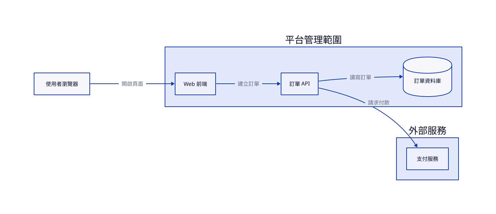

# 第 5 章　D2：用文字維護系統架構

> 樣章草稿。本例已使用 D2 v0.9.0 完成驗證、格式檢查及 SVG／PNG 匯出。它是虛構平台的同步呼叫視圖，不是完整生產架構。

## 5.1 同一組關係，不同的維護方式

[draw.io 短篇](08-drawio.md) 用可編輯節點及連線交付架構。本章保留相同的業務元件與呼叫關係，改用 D2 原始碼，讓讀者比較「改文字再生成」與「直接拖拉圖形」的差異。

D2 原始檔沒有本例 draw.io 那些逐一指定的 x、y 座標。作者描述元件、群組與關係，佈局引擎決定位置及走線。這適合跟程式碼一起審查的架構文件；若簡報要求某個元件精準對齊既有版面，draw.io 可能比較省事。

不要把「換工具」當成「換架構」。本例不加入訊息佇列、快取、閘道或微服務拆分，以免讀者無法判斷差別是來自工具還是需求。

## 5.2 圖的範圍與邊界

本圖回答兩個問題：有哪些呼叫關係？哪些元件由平台管理？

平台管理範圍內有 Web 前端、訂單 API、訂單資料庫；外部服務群組包含支付服務；使用者瀏覽器位於兩者之外。容器表示本圖約定的管理範圍，不代表 Kubernetes、Docker 或網路隔離，也不能直接推論安全信任等級。

箭頭表示呼叫方向，回應省略。Web 前端的部署方式、資料庫讀寫與付款請求的精確先後次序，沒有在這張圖定義。請求付款並不代表支付提供者一定同步回傳最終結果；回呼、對帳及失敗處理應讀其他流程文件。

[完整範例規格](../../examples/d2/order-platform/requirements.md)

## 5.3 先理解 D2 的 ID 與標籤

```d2
client: 使用者瀏覽器
web: Web 前端
client -> web: 開啟頁面
```

冒號前是識別碼，後方是顯示文字。連線使用 ID，不使用中文標籤。如此一來，改顯示名稱不必同時改所有引用。

D2 的便利也可能掩蓋錯誤：連線提到未宣告的物件時，D2 可以自動建立它。因此 `orders` 打錯成 `order`，不一定讓驗證失敗，反而可能多出一個非預期元件。通過 parser 後仍要把圖上的元件清單對回需求。

## 5.4 容器讓範圍變得明確

```d2
platform: 平台管理範圍 {
  web: Web 前端
  orders: 訂單 API
  db: 訂單資料庫 {
    shape: cylinder
  }
}

platform.web -> platform.orders: 建立訂單
platform.orders -> platform.db: 讀寫訂單
```

巢狀 map 建立容器，完整路徑 `platform.orders` 指向容器內的元件。若在最外層寫 `orders`，它可能不是你想要引用的那個物件。

本例只用一層容器。不要因為巢狀語法方便，就把組織、機房、網段、應用與模組全部套在一張圖裡；不同邊界的意義應分開說明，必要時拆成多張視圖。

## 5.5 完整圖與提示詞

[原始碼](../../examples/d2/order-platform/order-platform.d2) · [提示詞](../../prompts/d2-order-platform.md)



[PNG 備用預覽](../../examples/d2/order-platform/order-platform.png)

圖中四條呼叫應為：瀏覽器到前端、前端到訂單 API、訂單 API 到支付服務，以及訂單 API 到資料庫。前兩條主要由左向右，支付服務放在獨立容器，具體位置由佈局決定。

draw.io 試作的第一條邊標為 HTTPS；本圖改為「開啟頁面」，讓四條邊都描述動作。這是標籤一致性的調整，不是通訊協定的新增或刪除；不能從本圖推論明文 HTTP。

提示詞除了要求生成 D2，也要求交付元件與邊清單。AI 的說明文字和實際圖必須一起檢查，不能因為它在文字中列對了關係，就假設箭頭也接對。

## 5.6 固定版本、佈局與字型

從 [官方安裝文件](https://d2lang.com/tour/install/) 選擇適合自己的方式。若要重現本例，使用 [v0.9.0 發布頁](https://github.com/d2lang/d2/releases/tag/v0.9.0) 的對應平台版本，不要直接把最新版本當成相同環境。

先執行：

```sh
d2 version
d2 validate examples/d2/order-platform/order-platform.d2
d2 fmt --check examples/d2/order-platform/order-platform.d2
```

本例固定 `dagre` 佈局。可用 `d2 layout` 查看本機可用引擎，不能假定每種引擎都已安裝、授權條件相同或支援一樣的選項。本章沒有測試其他佈局引擎，不根據印象比較速度或品質。

繁體中文需可用字型。本次使用 NotoSansTC-VF.ttf，同時指定一般與粗體的字型輸入；使用同一檔案不保證粗體就有更強的視覺字重。實際圖仍要檢查。

在類 Unix shell，先把字型路徑改成自己下載的位置：

```sh
FONT=/absolute/path/to/NotoSansTC-VF.ttf
d2 --layout=dagre --font-regular="$FONT" --font-bold="$FONT" examples/d2/order-platform/order-platform.d2 examples/d2/order-platform/order-platform.svg
d2 --layout=dagre --font-regular="$FONT" --font-bold="$FONT" examples/d2/order-platform/order-platform.d2 examples/d2/order-platform/order-platform.png
```

`FONT` 是本例 shell 變數，不是 D2 自動尋找的設定名稱。PowerShell 語法不同，可直接在參數中填入自己的字型路徑。

SVG 與 PNG 都由 D2 CLI 直接產生。本次環境已具備瀏覽器相關相依；PNG 在新環境可能需要額外相依或下載，不能把本機成功當作乾淨機器必然成功。

## 5.7 驗證不是只看退出碼

本例執行 `validate` 成功，`fmt --check` 成功，兩種匯出都成功。但驗收還包括：

- 圖上的業務元件與需求相符，沒有因打錯 ID 而多出的節點。
- 前端、API、資料庫在平台管理範圍內，支付服務在外部群組。
- 四條邊的方向與標籤符合規格。
- 中文沒有缺字方框，容器標題及節點沒有裁切。

本次視覺檢查確認上述關係可辨識。仍有排版問題：「請求付款」靠近平台容器底邊；連線文字較細，縮圖時閱讀較吃力。這些問題不影響原始碼可用性，但正式印刷前應改善。

[完整驗證紀錄](../../examples/d2/order-platform/verification.md) 區分已執行與未測項目。本章不宣稱已做跨平台或 CI 測試。

## 5.8 一個小改動可能造成整張圖重排

D2 的文字差異通常比 GUI 圖檔簡短，但短 diff 不等於視覺變化很小。增加一個節點或延長標籤，都可能讓佈局改變。審查時要同時看原始碼與新預覽。

不要手改 SVG 後把它當作下一次生成的輸入。此例以 `.d2` 為權威原始檔，修改後重新產生兩種預覽。如果需要人工完成精細排版，應明確移交到另一種來源格式，而不是讓 D2 與 draw.io 各自變成兩份互相衝突的真相。

容器的分組本身也是架構敘述。把支付服務移入 platform 並不只是把框拉近，而是改變管理邊界；這類修改須先確認需求。

## 5.9 練習與選擇

練習一：只將 `platform.orders` 標籤改成「訂單服務 API」，保留 ID。重新驗證及渲染，確認業務關係不變，並觀察字串長度對排版的影響。

練習二：在副本故意把一條邊的 `platform.orders` 寫成 `platform.order`。觀察 `validate` 是否會阻止它，以及渲染圖是否多出元件。這是教學用錯誤實驗，不是本例既有缺陷。

當團隊主要以文字、Git 和生成流程維護圖時，D2 很合適。當修改主要發生在會議中、需要逐個物件拖拉與精確對齊時，可參考 draw.io 短篇。先決定誰接手維護，再選工具。

## 官方參考

- [安裝](https://d2lang.com/tour/install/)
- [容器](https://d2lang.com/tour/containers/)
- [連線與自動建立物件](https://d2lang.com/tour/connections/)

官方文件會更新。本例版本、字型指紋及匯出紀錄隨檔保存，沒有將工具二進位或字型重新分發。
