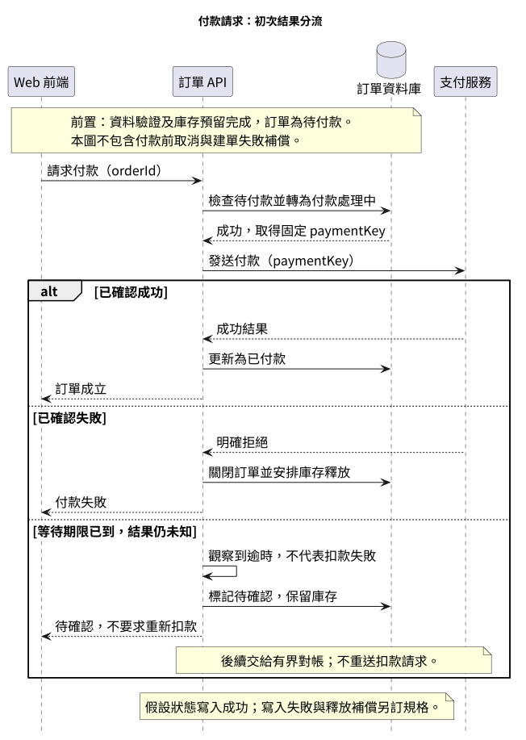
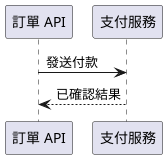
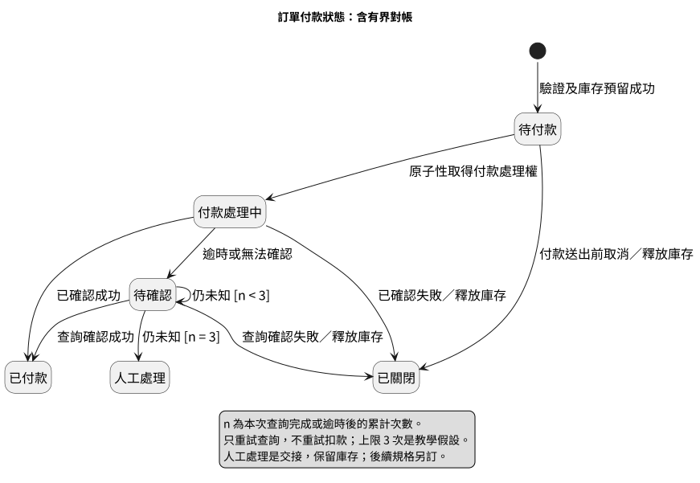
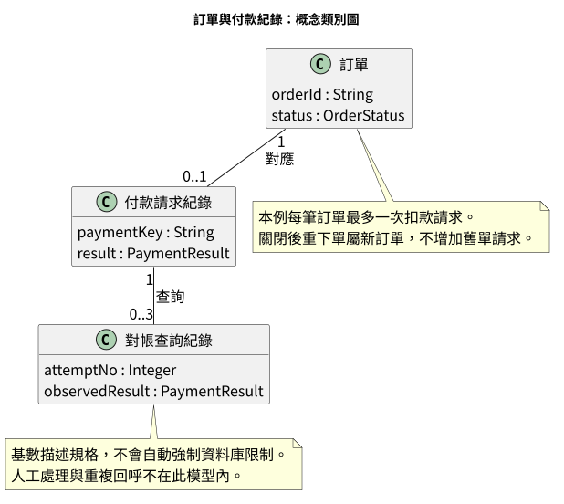

# 第 6 章：PlantUML，把付款互動與狀態講清楚

> 樣章草稿。三個範例均以 PlantUML 1.2026.8 在本機完成語法檢查及 SVG／PNG 渲染；未執行真實金流程式或跨平台測試。

## 6.1 架構圖沒有告訴你的事

[D2 架構章](05-d2.md) 說明前端、訂單 API、資料庫與支付服務之間的呼叫關係，但沒有回答「哪個訊息先發生」或「逾時後訂單是什麼狀態」。把這些內容全部加到架構圖，只會讓箭頭混用不同含義。

本章分成三張圖：時序圖說明初次請求的訊息順序；狀態圖描述訂單在事件發生後如何轉移；類別圖說明訂單、付款請求及查詢紀錄的關係。它們使用同一份[需求與教學假設](../../examples/plantuml/payment/requirements.md)，但不是互相替代的圖。

## 6.2 先說明本章新增的假設

沿用 Mermaid 章的原則：付款結果未知不等於失敗。只有明確失敗或付款送出前取消，才走關閉及釋放庫存路徑。

本章進一步展開原本交給對帳的部分：每筆訂單最多一個扣款請求，使用固定 paymentKey；結果未知時只查詢原請求，不重新扣款。自動查詢最多三次，每次查詢完成或逾時都計數。第三次仍未知，交人工處理並保留庫存。

「三次」是教學假設，不是任何支付服務的標準建議。查詢間隔、總等待期限、人工服務時限與庫存保留期限尚未定義，不能直接把本圖拿去當生產環境規格。它限制次數，不保證處理會在某個時間內完成。

## 6.3 時序圖：誰在什麼時候發送訊息



[原始碼](../../examples/plantuml/payment/payment-sequence.puml) · [PNG](../../examples/plantuml/payment/payment-sequence.png)

圖由上往下讀，參與者由左至右為前端、API、資料庫、支付服務。頂端註記限定前提：資料驗證與庫存預留已完成，而且本圖假設取得付款處理權及狀態寫入成功。

最小語法如下：



中文標籤與英文別名分開。實線及虛線在本章分別用於請求與回覆，但這是圖的表達約定，不會讓工具檢查實際協定。

完整圖使用 `alt / else / end` 表示互斥分支：確認成功、確認失敗、等待逾時但結果仍未知。三條路不會依序全部執行。不要把 `else` 看成「下一個步驟」。

逾時被畫成 API 自身的訊息，因為這是呼叫端觀察到等待期限到達，而不是支付服務送出一個「我逾時了」的正常回覆。這個差別決定後續是否有權直接關單。

API 對前端回覆待確認後，後續查詢交給另一條流程。時序圖沒有畫出全部查詢訊息，不代表它們不存在；本章以狀態圖說明查詢結果對訂單的影響。

## 6.4 狀態圖：允許哪些轉移



[原始碼](../../examples/plantuml/payment/order-state.puml) · [PNG](../../examples/plantuml/payment/order-state.png)

狀態描述的是訂單的當下條件，不是程式模組或訊息。`Pending`、`Processing`、`Unknown` 等是穩定 ID，中文名稱供讀者閱讀。

付款處理中可以轉為已付款、已關閉或待確認。待確認之後可以因查詢確認結果而離開；只有仍未知且累計查詢次數未滿三次，才留在待確認。

圖例中的 n 指「本次查詢完成或逾時後」的累計次數。第三次若查到成功，仍走已付款；只有第三次仍未知才轉人工。重試的是查詢，不是扣款。

`[*]` 在 PlantUML 狀態圖可表示起始或終止。本圖只有起始點，沒有把已付款、已關閉或人工處理連到終止點：已付款後可能還有出貨或退款，人工處理更是交接，不代表整筆訂單的生命週期結束。

狀態圖中的箭頭與守衛條件是規格，不會自動實作鎖、排程、交易或計數。並行查詢如何避免重複累加、晚到結果如何處理，仍需另訂機制。

## 6.5 類別圖：用基數限制模型的意思



[原始碼](../../examples/plantuml/payment/payment-model.puml) · [PNG](../../examples/plantuml/payment/payment-model.png)

一筆訂單對應零或一筆付款請求紀錄；付款請求對應零到三筆自動對帳查詢紀錄。零筆付款請求對應尚未付款或付款前取消；零筆查詢對應初次就取得明確結果。

看基數時，要看它靠近哪個類別。Order 一端的 `1` 表示每筆付款請求屬於一筆訂單；PaymentRequest 一端的 `0..1` 表示一筆訂單最多一筆付款請求。

本圖用普通關聯，不使用組合菱形，因為本章沒有定義付款紀錄能否獨立保留、刪除訂單是否連帶刪除紀錄等生命週期規則。為了「看起來更像 UML」而添加組合關係，會替需求增加沒有依據的承諾。

OrderStatus 與 PaymentResult 是概念型別名稱，沒有在這張圖中展開所有列舉值。這不是 ER 圖，也不直接規定資料表或外鍵；`0..3` 更不會自動變成資料庫約束。

## 6.6 三張圖必須一致

本例交叉檢查：

- 時序成功分支更新已付款，對應狀態圖 Processing → Paid。
- 明確失敗分支關單，對應 Processing → Closed。
- 逾時分支只標記待確認，對應 Processing → Unknown。
- 自動查詢上限與類別圖 `0..3` 一致。
- 不重新扣款與 Order 到 PaymentRequest 的 `0..1` 一致。

如果日後允許同一訂單多次付款嘗試，不能只把類別圖基數改成星號；時序、冪等鍵作用域、狀態轉移及對帳歸屬也要一起重新設計。

## 6.7 在本機驗證與匯出

[範例 README](../../examples/plantuml/payment/README.md) 提供完整命令。本次使用 Temurin JRE 21.0.12.1+1、PlantUML 1.2026.8、Noto Sans CJK TC。

```sh
java -Djava.awt.headless=true -DPLANTUML_SECURITY_PROFILE=SANDBOX -jar /path/to/plantuml-1.2026.8.jar -charset UTF-8 -checkonly "examples/plantuml/payment/*.puml"
java -Djava.awt.headless=true -DPLANTUML_SECURITY_PROFILE=SANDBOX -jar /path/to/plantuml-1.2026.8.jar -charset UTF-8 -tsvg -failfast2 "examples/plantuml/payment/*.puml"
java -Djava.awt.headless=true -DPLANTUML_SECURITY_PROFILE=SANDBOX -jar /path/to/plantuml-1.2026.8.jar -charset UTF-8 -tpng -failfast2 "examples/plantuml/payment/*.puml"
```

首次製作本章時，該驗證環境尚未安裝 Graphviz；第 7 章才另行配置。狀態圖及類別圖明確使用 `!pragma layout smetana`，本次已成功渲染；這不代表所有 UML 圖都能在所有版本使用相同方式。`-version` 的一般 Graphviz 警告不能取代對實際範例的驗證。

安全設定採 SANDBOX，不載入遠端 include 或外部圖示。不要把公司機密流程貼到公開 PlantUML 伺服器；圖檔也可能含原始碼中繼資料，公開前應把來源與成品一起檢查。

## 6.8 從排版失敗中修正

第一版狀態圖把查詢次數的長說明放在自迴圈旁，文字與註解引線擠在一起。修正時把條件縮為 `[n < 3]` 與 `[n = 3]`，將計數定義移到下方圖例，再重新匯出。

第二次視覺檢查確認字線重疊已消除，條件與圖例可讀；右側長標籤仍接近邊緣。時序圖第三分支標籤也略擁擠。它們是後續紙本排版改善點，不能以「能輸出 PNG」宣稱已完成出版品質檢查。

[驗證紀錄](../../examples/plantuml/payment/verification.md) 保存版本、範圍及成品雜湊。檢查結果只針對文件與圖像，沒有金流 API 測試。

## 練習

將自動查詢上限改為五次。先列出要同步修改的狀態條件、圖例、類別基數與需求文字，再修改原始檔。不得順便增加扣款重試，也不能把第三次查詢成功誤判成人工處理。

額外思考：如果第三次查詢仍未知但稍後收到成功回呼，誰有權更新訂單？本例未定義，應先提出規格問題，不要擅自在狀態圖畫一條線當作答案。

## 官方資料

- [時序圖](https://plantuml.com/sequence-diagram)
- [狀態圖](https://plantuml.com/state-diagram)
- [命令列](https://plantuml.com/command-line)
- [Smetana](https://plantuml.com/smetana02)
- [安全設定](https://plantuml.com/security)

官方 CLI 文件包含新介面說明；本章使用的是已在指定版本實測的命令，未把文件中的未測選項當成已驗證功能。

## 章節導覽

[全書目錄](../chapters.md) · [共用術語](../glossary.md) · [驗證狀態](../validation-status.md) · [上一章](05-d2.md) · [下一章](07-graphviz.md)
