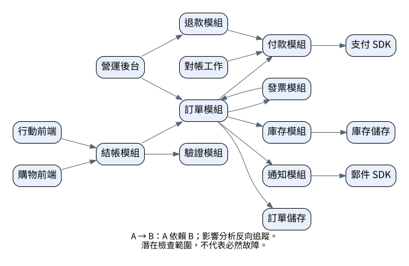
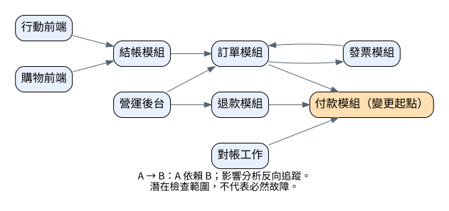

# 第 7 章　Graphviz：從依賴資料產圖與篩選影響

> 樣章草稿。本章包含可執行的 Python 產圖程式、測試與 Graphviz 成品。資料是刻意設計的虛構教學清單，不是掃描真實程式庫的結果。

## 7.1 先說清楚箭頭，才能談影響

本章的 `A → B` 表示 A 依賴 B。若付款模組改變，應找誰依賴付款，再找誰依賴那些使用者。這是沿邊的反方向追蹤，而不是從付款順著箭頭找它使用的 SDK。

資料圖與分析結果圖保留相同的箭頭含義。不要為了凸顯「影響傳播」而把結果圖的箭頭全部倒過來，卻沿用同一個圖例。

這與先前的同步呼叫視圖不同：本章是模組依賴視圖，不表達呼叫時間、成功與失敗分支，也沒有宣稱每一條依賴都會在每次請求中執行。

## 7.2 用小型資料集學會大圖的處理方式

本例總覽有 16 個節點、17 條不重複的有向邊，足以展示多層依賴、共享依賴與循環。它不是大型效能基準，也不代表已測試數千節點。

當真實資料變大，第一個方法應是篩選視圖，而不是不停縮小字體。可以按變更起點、模組群組或特定路徑縮小範圍；本章實作其中一種：變更節點的反向可達集合。

資料見 [dependencies.json](../../examples/graphviz/dependencies/dependencies.json)。它使用一個 ID → 中文標籤的 nodes 映射，以及 `[使用者, 被依賴者]` 的 edges 清單。元件名稱由資料決定，不由 AI 自行推測。

發票與訂單相互依賴是刻意加入的教學問題。圖中能看出循環，不代表程式已做完整的強連通分量分析；本章程式只保證走訪遇到循環時不會無限重複。

## 7.3 DOT 的最小語法


`digraph` 表示有向圖，`->` 表示有向邊，`rankdir=LR` 讓分層佈局偏向由左至右。ID 與顯示文字分開，中文標籤指定字型。

本例用 `dot` 佈局，適合有方向的依賴圖。它會嘗試減少交叉，不保證沒有交叉。不要把 DOT 語法與 dot 引擎混為一談；Graphviz 還有其他引擎，本章沒有替它們做比較測試。

## 7.4 從 JSON 產生總覽

[產圖程式](../../scripts/graphviz_dependencies.py) 只使用 Python 標準函式庫。它不執行輸入資料中的指令，也不呼叫 shell；中文標籤與 ID 經過字串引用處理，再寫入固定 DOT 結構。

程式先檢查節點映射、邊清單、變更起點及連線端點。不能因 DOT 允許在連線中隱含建立節點，就忽略拼字錯誤。相同方向的重複邊去重，輸出按 ID 排序，降低輸入順序引起的差異。

```sh
python3 scripts/graphviz_dependencies.py examples/graphviz/dependencies/dependencies.json examples/graphviz/dependencies/generated --changed payment
```

輸出 overview.dot、impact.dot 與 impact.json。輸出目錄中的同名檔案會被覆寫，請使用專用生成目錄，勿將手工文件放在這些檔名下。



[PNG 預覽](../../examples/graphviz/dependencies/generated/overview.png)

## 7.5 反向追蹤怎麼做

對每條 `consumer → dependency`，建立反向索引 `dependency → consumers`。從 payment 開始，將未訪問的使用者加入待處理集合，直到沒有新的使用者。

已訪問集合有兩個用途：避免共同上游被重複計入，也防止訂單／發票的循環讓程式跑不完。集合包含變更起點本身，表示要檢查的範圍包含正在修改的模組。

篩選完成後，保留兩端都在集合內的原始邊，形成誘導子圖。箭頭沒有反轉；反向是走訪方向，不是輸出的資料語意。



[PNG](../../examples/graphviz/dependencies/generated/impact.png) · [機器可讀結果](../../examples/graphviz/dependencies/generated/impact.json)

本次得到 9 個節點、10 條邊：付款、訂單、退款、對帳、結帳、發票、營運後台及兩個前端。支付 SDK 不在結果中，因為本例關心誰依賴付款，不是付款依賴誰。

這不表示 SDK、庫存或通知永遠不需要測試。它只表示在這份依賴資料及此種方向定義下，沒有被選入反向可達集合。實際回歸測試仍要考慮介面、行為、資料及隱含依賴。

## 7.6 讓分析程式先通過測試

[隨書測試](../../tests/test_graphviz_generator.py) 用真實子程序執行 CLI，不用模擬結果。

```sh
python3 -m unittest discover -s tests -p 'test_graphviz_generator.py' -v
```

本次三個測試方法全部通過，涵蓋：反向傳遞與循環終止；不合法資料在輸出前被拒絕；單獨觀看圖時仍有箭頭語意說明。非法輸入測試再分成未知端點、未知起點、錯誤邊形狀與非文字標籤。

開發時先看到功能缺少造成失敗，再實作。增加輸入驗證時，測試先揭露 traceback 與可能建立半成品的問題；增加圖例時，先讓缺少語意說明的測試失敗，再修改產圖程式。

這些測試不等於全面安全稽核。它沒有負載上限、完整 JSON Schema 或重複 JSON key 檢查；本例是可信小型教學資料的 CLI，不應直接當成公開上傳服務。

## 7.7 渲染與版本差異

安裝 Graphviz 並確認 `dot -V`，在根目錄執行：

```sh
dot -Tsvg examples/graphviz/dependencies/generated/overview.dot -o examples/graphviz/dependencies/generated/overview.svg
dot -Tpng examples/graphviz/dependencies/generated/overview.dot -o examples/graphviz/dependencies/generated/overview.png
dot -Tsvg examples/graphviz/dependencies/generated/impact.dot -o examples/graphviz/dependencies/generated/impact.svg
dot -Tpng examples/graphviz/dependencies/generated/impact.dot -o examples/graphviz/dependencies/generated/impact.png
```

本機使用 Ubuntu 套件 2.42.2-9ubuntu0.1，其中 `dot -V` 顯示 Graphviz 2.43.0。驗證紀錄同時保存套件版與執行檔回報，沒有把兩者強行改成一樣。

這次沒有系統安裝權限，因此將套件解到使用者工具目錄，並只在命令環境設定函式庫／外掛路徑。讀者一般應使用適合自己系統的正式安裝方式；書中不要求照搬維護者本機的絕對路徑。

中文字型使用 Noto Sans CJK TC。SVG 字型可能隨讀者檢視環境替換，PNG 保存本次字型渲染結果。圖檔與原始 JSON、程式碼都應一起保留。

## 7.8 大圖的可讀性：總覽用來找問題，局部用來討論

總覽裡訂單模組的線條集中，訂單到付款與發票回向訂單的路徑有局部交叉。付款影響子圖省略不相關的下游後，循環的兩條方向更容易辨識。

初版圖沒有箭頭圖例，單獨貼進簡報可能被誤讀。加入底部「A → B：A 依賴 B；影響分析反向追蹤」及「潛在檢查範圍，不代表必然故障」後重新渲染，確認圖例完整且沒有裁切。

不要為了消除循環線就刪掉其中一條依賴。那會讓圖更乾淨，卻隱藏真實資料中的問題。需要分組或折疊時，也要說明省略了什麼。

## 練習

把起點改成 payment_sdk，輸出到另一個目錄。它的反向影響應包含 payment 與 payment 的所有上游，而不是只包含 SDK。再把起點改成沒有依賴方的節點，確認它本身仍保留。

進階練習：為循環群組上色。先定義強連通分量的規則及測試，再修改分析程式；不要只靠畫面上兩條箭頭看起來相反就猜測所有循環。

## 官方參考

- [DOT 語言](https://graphviz.org/doc/info/lang.html)
- [dot 佈局](https://graphviz.org/docs/layouts/dot/)
- [下載與安裝](https://graphviz.org/download/)

本章展示可重現的小型分析流程，不宣稱已從真實倉庫抽取依賴、測試大型效能或完成 CI。
