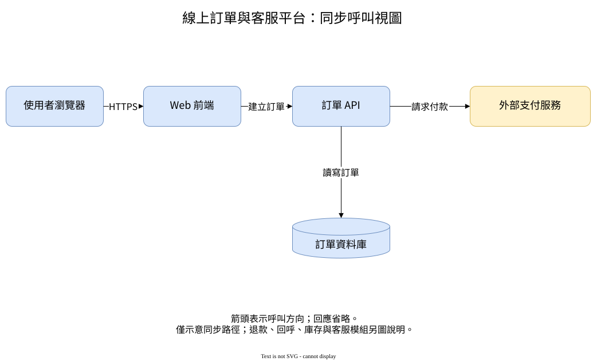

# 第 8 章：draw.io，讓 AI 草稿能由人接手

> 擴寫樣章草稿。既有範例曾驗證節點拖曳、API 文字修改、連線綁定及 XML 重新載入；本輪僅擴稿與結構複查，原生保存對話框、桌面版與跨平台仍未測。

## 8.1 交付的不是一張無法修改的圖片

架構評審時，團隊常會說：「把資料庫移到旁邊」「這個服務名稱要改」「支付服務是外部的」。如果 AI 只交付 PNG，這些修改就得重新繪製。

本例交付 `.drawio` 原始檔，讓讀者能單獨選取元件、編輯標籤與移動節點。SVG、PNG 用於預覽，不作為唯一的維護來源。不要把向量格式誤認為原生可編輯圖：普通 SVG 匯入後不一定保留 draw.io 節點與連接關係。

[下載／檢視原始檔](../../examples/drawio/order-platform/order-platform.drawio) · [範例操作說明](../../examples/drawio/order-platform/README.md)



## 8.2 先定義箭頭的意思

本圖包含使用者瀏覽器、Web 前端、訂單 API、外部支付服務及訂單資料庫。箭頭表示誰呼叫誰，回應省略。它不表示呼叫的精確時間順序，也不代表已定義交易或失敗補償。

例如「訂單 API → 資料庫」的單向箭頭並不是資料只能寫入、不能讀回；此處是呼叫視圖，讀取結果的回傳沒有另外畫線。若要說明付款請求與資料庫寫入的先後次序，應另畫時序圖。

平台名稱包含客服，但本圖只展開訂單同步路徑；客服、庫存、退款與支付回呼刻意省略。外部支付服務以名稱及黃色底色共同標示，不只依賴顏色傳達含義。

## 8.3 AI 應該產生什麼

本例採未壓縮 XML，方便讀者檢查與比較。基本結構是 `mxfile → diagram → mxGraphModel → root → mxCell`。

- `vertex="1"` 表示節點。每個節點有唯一 ID、顯示文字與位置尺寸。
- `edge="1"` 表示連接線。`source`、`target` 必須指向現有節點 ID。
- `mxGeometry` 保存座標與尺寸；它不是節點的業務身份。
- 保留固定 ID，局部改標籤或座標，能降低後續合併修改的困難。

[本例提示詞](../../prompts/drawio-order-platform.md) 要求只用內建形狀、繁體中文標籤，不嵌入外部圖片、HTML 或執行程式碼。大型 XML 很容易出現重複 ID、未跳脫的 `&` 或懸空連接，AI 生成後仍需解析與編輯器驗證。

把連線畫到節點旁邊不等於綁定到節點。判斷方法是移動節點：如果線留在原地，就不是可以放心交接的圖。

## 8.4 用自己的瀏覽器開啟並修改

1. 在 GitHub 原始檔頁面選擇下載原始檔，保留 `.drawio` 副檔名；不要另存成 HTML 網頁。
2. 開啟 https://app.diagrams.net/ ，依畫面選擇裝置／本機儲存。
3. 用「File → Open From → Device」開啟下載的檔案；介面語言或版本可能使選單文字不同。
4. 選取「訂單 API」，向下拖曳，觀察前端、支付與資料庫的三條連線是否仍連接。
5. 雙擊文字，把名稱改為「訂單服務 API」。
6. 另存為 `order-platform-edited.drawio`，關閉圖後重新開啟，確認位置、標籤和連線都保留。

不要把敏感架構送到公開 Issue 或任意線上轉檔服務。離線需求應使用經組織允許的桌面版；本篇不把網址中的選項當作離線安全保證。

## 8.5 首次範例驗證究竟測了什麼

首次驗證使用 diagrams.net 已載入的真實 EditorUi 編輯器（版本 31.4.5）載入 XML，並用瀏覽器滑鼠事件拖動「訂單 API」：位置由 `(560,160)` 變為 `(560,210)`。三條相連邊仍指向原節點 ID。

文字修改透過編輯器 API 完成，接著序列化模型並重新載入，確認「訂單服務 API」與新座標保留。最後恢復原圖才匯出預覽，所以隨書原始檔仍是原始名稱與位置，便於讀者重做練習。

這次沒有走一遍使用者的檔案選擇器與「另存新檔」對話框，也沒有測試雲端儲存。API 模型往返與滑鼠拖曳已驗證；GUI 儲存流程是讀者練習，不宣稱已完成測試。

[機器可讀紀錄](../../examples/drawio/order-platform/edit-verification.json) · [驗證範圍與成品雜湊](../../examples/drawio/order-platform/verification.md)

## 8.6 預覽能看，還要檢查哪些事

SVG 由編輯器直接匯出。PNG 由 Chrome 對該 SVG 產生，不是透過 draw.io 的 PNG 匯出選單。預覽中中文完整，未見裁切或節點文字重疊。

樣稿仍有可改善處：連線標籤較靠近線與箭頭；HTTPS 是協定名稱，其餘標籤是動作，正式版可統一為「動作＋協定」。標題使用整個平台名稱，單獨放入簡報時可改成「訂單建立：同步呼叫視圖」，避免讓讀者以為這就是完整平台。

若檢視平台無法顯示 SVG，可改看 [PNG](../../examples/drawio/order-platform/order-platform.png)。本例使用純文字標籤減少 HTML／foreignObject 相容性問題，但字型仍受讀者裝置影響。

## 8.7 人工修改後，不要再讓 AI 覆蓋整張圖

把目前 `.drawio` 當作唯一來源。需要 AI 修改時，提供現有檔案與明確的改動範圍，例如「只改 orders 的文字，保留其餘座標與 ID」。不要重新給一段模糊需求，要求生成全新圖，再期待之前的人工調整自動保留。

大型修改先在副本進行。對照 XML 差異時，注意真正的節點與邊變更，不要把編輯器更新的畫布參數都當成業務變動。提交前重新開啟原始檔，並同步產生預覽。

## 8.8 從一條連線讀懂 XML

下列片段取自原生模型，省略樣式與幾何資料，只看業務端點：

```xml
<mxCell id="e3" edge="1" parent="1"
        source="orders" target="payment" value="請求付款" />
```

`e3` 是連線自己的 ID，`orders` 與 `payment` 是它連接的節點。移動 payment 時，連線應跟著端點重新排線，而不是只維持畫布上的固定終點。

本例節點的 `mxGeometry` 使用 x、y、width、height；連線的幾何資料則含 `relative="1"`。不要因兩者都叫 geometry，就把節點座標抄進連線當作綁定。單獨匯入上方片段也不是完整圖：它需要 mxfile、模型根節點及被引用的兩個節點。

畫面上的標題和說明也可以是 `vertex="1"`。因此不能把所有 vertex 的數量直接叫做「業務元件數」。本例有五個業務元件，另有標題與說明文字物件；比對需求時應按 ID 與角色分類。

本例所有業務元件放在同一圖層下，沒有建立代表平台內外的巢狀容器。外部身份靠名稱與顏色說明，不能拿這份 XML 宣稱 D2 的容器結構也被無損保留。

## 8.9 先用副本練習局部修改

假設交接者只要將訂單 API 改名為「訂單服務 API」。先另存副本，再將修改限制在 `orders` 的顯示標籤。不要換 ID、刪線重接，或順手替支付服務更名。

檢查可以分三步：

1. 修改前列出 e2、e3、e4 的端點。
2. 修改後確認端點仍是 web→orders、orders→payment、orders→db。
3. 真正開啟、移動、保存與重開，確認模型及畫面都保留；沒有走過的步驟填未測。

如果要調整位置，讓 geometry 改變是合理的；如果只改名稱，幾何資料的大幅變動就值得檢查。比較差異時應允許編輯器修改必要的畫布 metadata，但不能用「工具自動改的」忽略刪除節點或端點替換。

可用 [局部修改交接單](../../templates/drawio-change-request.md) 記錄允許變更與禁止變更。模板不是完成證據；填好後仍需執行。

## 8.10 多人修改與衝突處理

兩人同時修改 `.drawio` 時，文字檔合併成功只代表沒有留下 Git 衝突標記，不保證圖能正確開啟。一個人可能移動 orders，另一個人則複製新節點並刪掉舊 orders，合併後的連線就可能引用錯誤 ID。

合併前先看各自的修改目的，再檢查 ID 唯一、父節點存在及端點引用。最後仍需真實編輯器重開。不要用重新生成整張圖來「解衝突」，除非團隊接受放棄人工版面，並重新驗收所有關係。

本書沒有實作通用 `.drawio` 合併器，也沒有驗證壓縮或多頁檔案合併。本章以單頁、未壓縮模型示範；遇到不同格式應先辨識來源，而不是把查不到 mxCell 當作檔案必然損壞。

## 8.11 匯出前的交接清單

| 交付項 | 檢查方式 | 本例限制 |
| --- | --- | --- |
| 原生模型 | 真正開啟，選中節點與連線 | 初次測試用 EditorUi API 載入 |
| 人工編輯 | 移動節點、改標籤，檢查綁定 | 拖曳及 API 改字已有歷史證據 |
| 保存重開 | 保存修改檔，再開啟下載的檔案 | 原生另存對話框仍未測 |
| SVG／PNG | 檢查來源一致、範圍、文字及留白 | PNG 曾由 SVG 在 Chrome 轉出，不是 GUI PNG 匯出 |
| 版本 | 記錄來源 commit、工具與字型 | 不保證每個瀏覽器字寬相同 |
| 隱私 | 查原始資料、註解、外部圖片及連結 | 不以畫面沒看到秘密代表原檔沒有 |

如果需要以影像檔攜帶可編輯資料，先確認工具的匯出選項，再實際重新開啟驗證。普通 SVG 或 PNG 不提供這項保證；本例仍以 `.drawio` 為維護來源。

交接者若只收到圖片，請先找原生檔，而不是立即要求 AI 依圖重建。重建需要另外定義物件身份、端點及容器，不能假設會與原模型相同。

## 8.12 練習與參考判斷

### 練習一：只改名稱

把 orders 的文字改為「訂單服務 API」，保留其他 ID 與關係。參考：e2、e3、e4 的端點不變；較長標籤可能需要加寬，但需記錄這項額外幾何變更。原生保存流程要親自完成，不能引用本書舊紀錄代替。

### 練習二：支付服務改位置

把 payment 移到 orders 右下方，名稱改為「外部支付閘道」。參考：保留 payment ID、e3 仍由 orders 指向 payment、e4 仍指向 db。改名在本練習只是顯示調整，不代表供應商真的換了。

### 練習三：兩張圖的標籤不同

D2 第一條呼叫寫「開啟頁面」，draw.io 寫「HTTPS」。參考：兩者端點可能一致，但標籤分別表示動作與協定。第 11 章核心契約只比端點，不能用測試通過回答標籤是否一致。統一標籤前應先決定採哪種描述規則。

### 練習四：看似相連的線

在自己的副本中做一條只有幾何終點、沒有 source／target 的線。參考：靜態畫面可能像是連到節點，但移動後就能看出差別。這是讀者練習，本輪未執行新的 GUI 故障注入。

## 8.13 本輪擴稿的驗證邊界

本輪新增模型判讀、修改與合併流程、交接清單及練習參考，未改原圖或預覽。重新解析既有 XML、核對 ID／父節點／四條端點及 orders 的三條相連邊；再跑核心測試。

先前 EditorUi 拖曳、API 改字與模型重載的結果仍保留於原驗證檔。沒有在本輪重新操作 GUI，也沒有補測原生保存、桌面版、多人協作或所有瀏覽器。詳細結構複查與編輯範圍見 [本輪紀錄](../../docs/editorial/drawio-expansion.md)。

## 官方資料

- [原生儲存格式](https://www.drawio.com/doc/faq/save-file-formats)
- [SVG 匯出與字型相容性](https://www.drawio.com/doc/faq/export-to-svg)

本例未嵌入外部服務商圖示，也未將第三方編輯器程式碼打包進 Repo。

## 章節導覽

[全書目錄](../chapters.md) · [共用術語](../glossary.md) · [驗證狀態](../validation-status.md) · [上一章](07-graphviz.md) · [下一章](09-excalidraw.md)
