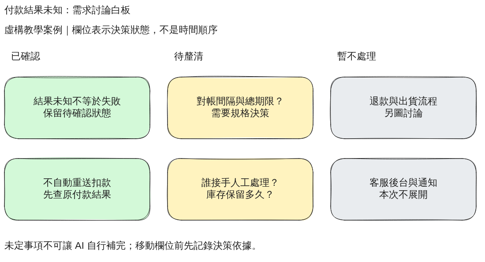

# 第 9 章：Excalidraw，先把未定的事留在白板上

> 樣章草稿。案例與需求均為虛構教學設定，不是真實會議紀錄。

## 9.1 為什麼此時不畫流程圖

付款逾時之後，團隊常同時討論技術動作、責任分工與尚未決定的政策。如果先請 AI 畫一條完整流程，它可能替我們決定查詢間隔、接手人員，甚至把「未知」改成「失敗」。圖雖完整，需求卻被偷偷改寫。

本章先做需求白板，不描述執行順序。三欄是「已確認」「待釐清」「暫不處理」，沒有流程箭頭。手繪感不代表規格可以含糊；每張便條仍需知道它是事實、問題，還是本次範圍的排除項。

[下載可編輯場景](../../examples/excalidraw/requirements-board/requirements-board.excalidraw) · [操作與檔案清單](../../examples/excalidraw/requirements-board/README.md)

## 9.2 先提供內容，不讓 AI 補答案

本例確認兩個教學前提：付款結果未知不等於失敗；不要自動重送扣款，而應查詢原付款結果。

尚未決定對帳間隔、總期限、人工接手者與庫存保留期限。退款、出貨、客服後台和通知只是本次不展開，不表示整個產品永遠不做。

第 6 章的「最多查詢三次」是該章的教學假設，不是本章自動採用的需求。跨圖協作時，必須區分為了示範而設定的數字與正式政策。

完整條件見 [需求單](../../examples/excalidraw/requirements-board/requirements.md)，可直接使用的 [AI 提示詞](../../prompts/excalidraw-requirements.md) 另存一份。

## 9.3 把 AI 輸出做成可編輯場景

要求 `.excalidraw` 原生 JSON，而不是把白板截圖貼進一個檔案。頂層包含 `type`、`version`、`elements`、`appState`、`files`；本例沒有嵌入圖片，`files` 為空。

便條用矩形和文字組成。文字的 `containerId` 指向矩形，矩形的 `boundElements` 指回文字；兩者有相同的 `groupIds`。這些關係讓拖曳便條時文字跟著走。只在同一位置放兩個物件，並不等於綁定。

ID 必須唯一且穩定。文字內容改了，不要任意重建全部 ID，否則版本比較會充滿無關差異。匯出 SVG／PNG 是交付預覽，不是原始檔可編輯性的證明。

## 9.4 實際開啟、移動與保存

1. 從範例目錄下載 `requirements-board.excalidraw`。不要將 GitHub 的 HTML 頁面另存成該副檔名。
2. 開啟 https://excalidraw.com/。已有未存工作時先另存，不要直接覆蓋。
3. 將場景檔拖入畫布，或從主選單使用 Open。
4. 找到「誰接手人工處理？」便條，沿水平方向稍移。框與文字應一起移動，且仍在「待釐清」欄。
5. 如要改字，可先進入群組，再雙擊文字。改動後檢查是否換行、超出框線或留下重複文字。
6. 使用主選單 Save to... 保存 `.excalidraw`；不同瀏覽器可能開啟另存對話框或直接下載。重新開啟下載的檔案，檢查位置與內容。
7. 用 Export image 匯出 SVG／PNG。取消 Only selected，避免只匯出選中的便條。確認背景和縮放；是否 Embed scene 必須明確選擇。

上述是讀者操作步驟，並非每一步都已自動化測試。此次實際驗證了匯入、滑鼠拖曳、瀏覽器重新載入、恢復原始場景及兩種影像匯出；未測原生另存對話框與雙擊改字。詳細證據見 [驗證紀錄](../../examples/excalidraw/requirements-board/verification.md)。

## 9.5 白板移動不等於決策成立

把黃色便條拖到綠色欄並不會使問題有了答案。先寫清楚答案、依據、誰確認，以及適用範圍，再移動便條、同步文字和顏色。

使用 [決策紀錄模板](../../examples/excalidraw/requirements-board/decisions.md)。本例未虛構會議日期、決策人或批准狀態。三欄標題承載分類語意，不能只靠顏色辨識。

例如，若經正式確認「總期限為某值」，才把對應結論整理到規格，再更新 PlantUML 的狀態或時序圖。沒有新依據時，不要為了讓六套圖看起來一致而捏造一致的數字。

## 9.6 練習與參考處理

練習一：有人說「逾時就是失敗，直接再扣一次」。請指出它與哪兩張已確認便條衝突。參考：結果未知不等於失敗，且不得自動重送扣款；不能直接將此建議畫成執行流程。

練習二：新增「通知失敗如何處理？」。參考：本次通知功能不展開，可以記為後續討論，不擅自設計重試次數。若改變範圍，要先留下變更紀錄。

練習三：自行另存修改版、重新匯入並輸出預覽。參考驗收：三欄仍可辨識，框和文字一起移動，新增便條未被裁切，原始檔與預覽一致。

## 9.7 限制與官方參考

線上版會更新，本次沒有固定應用程式 commit，不能宣稱跨版本可完全重現。瀏覽器本機儲存也不是永久備份；本次自動化途中曾出現空白分頁及空儲存狀態，重新匯入檔案後才恢復工作。

文字使用 Helvetica 字族設定，繁中由環境可用字型回退；其他電腦可能有不同字寬。雲端協作、觸控、桌面系統的保存流程尚未測試。不要把內部客戶資料放進公開場景，選用 Embed scene 時更須檢查是否帶入非預期內容。

- [官方場景恢復工具](https://docs.excalidraw.com/docs/@excalidraw/excalidraw/api/utils/restore)
- [官方影像與場景匯出工具](https://docs.excalidraw.com/docs/@excalidraw/excalidraw/api/utils/export)

六套工具的第一輪範例至此齊備；這不等於整本書已完成，也不等於所有平台和自動化發布都已驗證。

## 章節導覽

[全書目錄](../chapters.md) · [共用術語](../glossary.md) · [驗證狀態](../validation-status.md) · [上一章](08-drawio.md) · [下一章](10-debugging.md)
