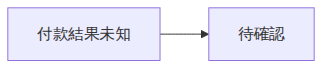
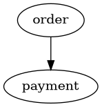

# 第 10 章：AI 繪圖除錯室

> 樣章草稿。此章的四組 broken／fixed 檔案是刻意製造的教學案例，不是真實事故。既有工具章的觀察另行引用，不混稱為本次重新測試。

## 10.1 先問「哪一層出錯」

AI 說「修好了」，通常只表示它改了文字。驗收需要另外回答四個問題：程式能解析嗎？圖意符合需求嗎？人看得清楚嗎？交付後還能修改嗎？

| 層次 | 典型症狀 | 最小證據 | 不能推論 |
| --- | --- | --- | --- |
| 語法／環境 | 指令失敗、空白圖 | 版本、命令、退出碼、原始錯誤 | 所有失敗都該改語法 |
| 語意／資料 | 方向相反、漏掉例外、節點拼錯 | 需求與節點／關係清單對照 | 能渲染就符合需求 |
| 視覺 | 缺字、壓線、裁切、縮圖不可讀 | 實際交付尺寸的預覽走查 | XML 合法就好看 |
| 交付／可編輯性 | 圖片可見但無法改字、移動後連線斷開 | 真正編輯、保存及重開 | 副檔名正確就能交接 |

環境錯誤先確認執行檔、瀏覽器與字型。若錯誤是 Chromium 不存在，補一個括號不會解決；若錯誤是 Parse error，也不應先重裝整套工具。

## 10.2 建立可反覆執行的小迴圈

固定輸入 → 執行同一命令 → 保存原始錯誤 → 提出可否證假說 → 一次只改一項 → 同命令重跑 → 檢查鄰近需求。

請保留壞版本。沒有它，就很難證明檢查確實能抓到這一種錯誤。本章將反例保存在 `broken.*`，修正版在 `fixed.*`；反例不可當作可部署或可直接採用的正式範例。

[四組重現檔、命令與輸出](../../examples/debugging/README.md) · [除錯提示詞](../../prompts/diagram-debugging.md)

## 10.3 案例一：Mermaid 少一個括號

錯誤版本：

```text
flowchart LR
    A[付款結果未知 --> B[待確認]
```

上方用一般文字區塊展示非法內容，避免章節頁面本身變成錯誤畫面。讀者應以 [broken.mmd](../../examples/debugging/mermaid/broken.mmd) 為重現來源，而不是把網頁錯誤訊息當作 CLI 執行證據。

本機 Mermaid CLI 回傳 exit 1，錯誤開頭為 `Error: Parse error on line 2:`。後面的預期 token 清單很長，但最小比對很短：節點 A 的左中括號沒有在箭頭之前關閉。

```text
A[付款結果未知 --> B[待確認]    ← 反例
A[付款結果未知] --> B[待確認]   ← 補上 A 的右中括號
```

只補一個 `]`，不改成「失敗」，也不加入重扣款分支。修正版相同命令 exit 0，SVG／PNG 均成功產生。



測試要求反例包含 `Parse error`，不只看非零退出碼；否則缺少瀏覽器也可能被誤認成「成功抓到括號錯誤」。測試還要求修正版 SVG 中保留「待確認」。

## 10.4 案例二：DOT 箭頭沒有目的端

[反例](../../examples/debugging/dot/broken.dot) 的核心是 `order -> ;`。Graphviz 回傳 exit 1，錯誤為 `syntax error in line 2 near ';'`。

先比對需求：此最小案例規定訂單依賴支付。若資料中已有 `payment`，只補成 `order -> payment;`；不要為了讓語法通過就新增沒有依據的節點。



本圖僅示範 DOT 語法修復。此處箭頭表示 order 依賴 payment，不是訂單先做、付款後做；極小圖省略業務圖例，不能直接當作完整交付圖。相同線條外觀可有不同語意，不能只憑圖片猜關係。

## 10.5 案例三：兩次 exit 0，仍有一次畫錯

案例需求固定為：前端依賴訂單，訂單依賴支付。`consumer -> dependency`，支付變更時反向追蹤可能需要檢查的元件。

| 資料 | 邊 | 產圖程式退出碼 | 實際影響清單 | 是否符合本例需求 |
| --- | --- | --- | --- | --- |
| broken.json | order → web、payment → order | 0 | payment | 否 |
| fixed.json | web → order、order → payment | 0 | order、payment、web | 是 |

兩份 JSON 都合法，節點也都存在。錯誤來源是輸入關係與需求相反，不是反向追蹤演算法失效；此案例不需要修改第 7 章產圖程式。

測試把預期集合明確寫為 `['order', 'payment', 'web']`。反例必須不符合，修正版必須符合。這只是三節點案例的需求斷言，不是通用的自然語言語意判定器，也不能證明真實服務必然故障。

[資料反例與修正版](../../examples/debugging/README.md#案例清單) · [實際影響清單與退出碼](../../examples/debugging/results.json)

## 10.6 案例四：多一個 s，節點不再是同一個

資料定義 `payment`，邊卻寫 `payments`。本章沿用第 7 章 CLI，實際回傳 exit 2，錯誤包含 `each edge must name two existing nodes`，且在全新輸出位置沒有建立產物目錄。

這不是要求 AI 遇到相似名稱就一律自動修正。先查案例的節點清單；本例明確只有 `payment`，才將邊中的識別碼改回它。真實需求若同時有兩個服務，合併名稱反而會出錯。

不要拿上次成功留下的 SVG 當作這次成功。使用新的暫存目錄，或明確管理來源、產物與雜湊。本章測試用暫存目錄隔離每個反例與修正版。

## 10.7 六套工具的視覺與交付問題

下表引用先前已保存的紀錄；本次沒有重新跑完這些編輯器操作。

| 工具 | 已觀察的問題或界線 | 處理與驗收 |
| --- | --- | --- |
| Mermaid | 整張訂單圖縮小時文字偏小、底部換行生硬 | 優先拆總覽與局部，不只盲目加大字；[原紀錄](../../examples/mermaid/order-flow/verification.md) |
| D2 | 支付標籤靠近容器底邊、連線文字縮圖偏細 | 區分容器歸屬正確與紙本可讀；此次僅 dagre，別宣稱其他引擎一樣；[原紀錄](../../examples/d2/order-platform/verification.md) |
| PlantUML | 狀態自迴圈文字與註解引線擁擠 | 縮短條件、把 n 的規則移入圖例，再重新匯出檢查；不能刪掉查詢上限語意；[原紀錄](../../examples/plantuml/payment/verification.md) |
| Graphviz | 總覽交叉線多 | 保留完整資料，另輸出影響子圖；不要只為排版刪真實依賴；[原紀錄](../../examples/graphviz/dependencies/verification.md) |
| draw.io | XML 合法不代表拖曳連線仍綁定 | 真正拖動節點、檢查三條邊端點，序列化及重新載入；原生另存對話框未測；[原紀錄](../../examples/drawio/order-platform/verification.md) |
| Excalidraw | 部分選取匯出、暫存不可靠、檔案 API 自動化限制 | 檢查 Only selected，保留原生檔，區分 Blob 接收器與系統保存；[原紀錄](../../examples/excalidraw/requirements-board/verification.md) |

中文字缺字要檢查字型是否真的被使用，而非只看設定裡寫了字型名稱。SVG 可在 A 電腦顯示，PNG 卻由 B 環境生成，也可能產生不同結果。用實際輸出的 PNG 檢查文字；字型嵌入前另查授權。

## 10.8 給 AI 的修復範圍

先交付最小原始檔、工具版本、完整命令、原始錯誤和一條可判定的需求。要求 AI 先提出最可能原因及反證方式，再做最小修補。

不要只說「幫我美化」。可以說：「保持三個分支與原有端點，只縮短顯示標籤；完整規則移到圖例；重新渲染後檢查有無裁切。不得自行更改查詢上限。」

若三次小修仍失敗，停止堆補丁，重新縮小案例、檢查環境及工具選型。回報時分開列出改了什麼、實際跑了什麼、仍未測什麼。

## 10.9 練習

1. 把 Mermaid `fixed.mmd` 的「待確認」改為「已失敗」。它可能仍可渲染，但違反本章未知不等於失敗的需求。參考：補語意斷言，而不是聲稱 parser 能懂金流規格。
2. 把反向依賴資料全部倒置後，直接跑渲染。參考：退出碼不會替代期望影響集合比對；依案例需求判定錯誤。
3. 在 Excalidraw 選中一張便條後匯出。參考：比較輸出內容與整圖需求；別把只輸出一張的 PNG 當作三欄白板。此練習尚未在本章重新執行。
4. 為自己遇到的問題填寫 [除錯紀錄模板](../../examples/debugging/debug-report-template.md)。要求另一人只用你的來源與命令就能重現，而不需要真實密碼或客戶資料。

## 10.10 本章驗證範圍

四組案例共八次核心 CLI 執行，結果詳見 [results.json](../../examples/debugging/results.json)。新增四個回歸測試，連同既有三個測試，本機共七個測試方法通過。這表示反例被預期方式辨識、修正版符合本例斷言，不是「所有圖都正確」。

兩組修正版 SVG／PNG 均實際匯出，PNG 經視覺檢查。本章四個除錯測試尚未納入遠端核心 CI；相關生成器及端點契約的 CI 狀態見 [驗證狀態導讀](../validation-status.md)。乾淨環境安裝、跨平台、印刷尺寸審查及六套編輯器的統一端到端測試仍未完成。

## 章節導覽

[全書目錄](../chapters.md) · [共用術語](../glossary.md) · [驗證狀態](../validation-status.md) · [上一章](09-excalidraw.md) · [下一章](11-cross-tool.md)
