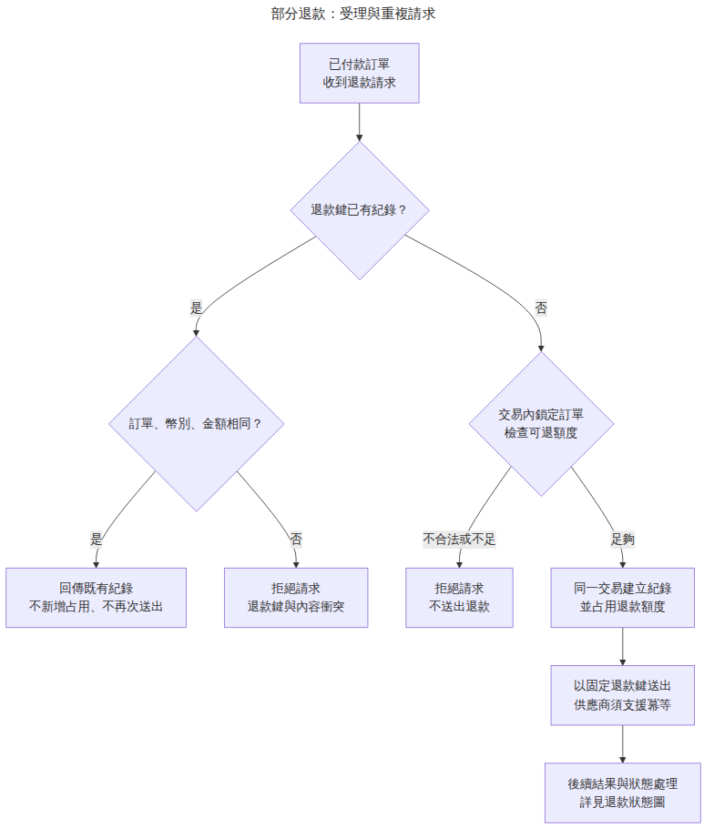
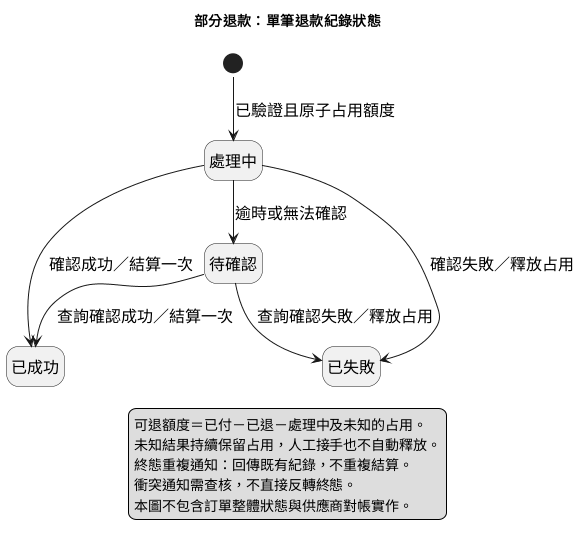

# 第 13 章：部分退款綜合專案

> 樣章草稿。本章是虛構需求變更與文件交接，不是可以直接上線的退款系統。沒有連接支付服務、執行真實退款或驗證資料庫交易。

## 13.1 先界定變更，不重寫歷史範例

原本付款案例處理的是第一次扣款及其成功、失敗、未知結果。本章新增「已確認付款成功後，允許多次部分退款，累計不得超過原付款」的教學需求。

新例放在 [examples/refund-change](../../examples/refund-change/README.md)，不修改第 4 至 9 章的既有圖。這不是漏同步：原圖有明確範圍，新增退款應有自己的來源與驗證。若之後要整合成正式產品規格，需另行確認哪份文件被取代。

交付包括 [需求單](../../examples/refund-change/requirements.md)、[跨工具影響表](../../examples/refund-change/change-impact.md)、兩份可編輯來源、四張預覽、金額情境與實測紀錄。

## 13.2 額度不是「原金額減掉成功退款」而已

本例所有金額以整數新臺幣元表示，暫不處理小數、跨幣別、手續費、爭議款、退貨物流或稅務。這是教學範圍，不是金融系統通用金額規格。

```text
可退額度 = 已付金額 - 已成功退款 - 已占用退款額度
0 < 本次金額 <= 可退額度
已成功退款 + 已占用退款額度 <= 已付金額
```

占用包含處理中與結果未知的退款。若只扣已成功退款，先前逾時但可能已成功的一筆就會被遺忘，讓新請求再次使用同一份額度。

| 情境 | 已付 | 已退 | 已占用 | 本次要求 | 可退 | 判定 |
| --- | ---: | ---: | ---: | ---: | ---: | --- |
| 第一次部分退款 | 1000 | 0 | 0 | 300 | 1000 | 額度允許 |
| 另有未知退款 | 1000 | 300 | 200 | 400 | 500 | 額度允許 |
| 超過剩餘額度 | 1000 | 300 | 200 | 600 | 500 | 拒絕 |
| 零元 | 1000 | 0 | 0 | 0 | 1000 | 拒絕 |
| 負數 | 1000 | 0 | 0 | -1 | 1000 | 拒絕 |
| 已全數占用 | 1000 | 300 | 700 | 1 | 0 | 拒絕 |

以上只判斷此例的金額條件，不替代付款狀態、訂單所有權、操作權限及防詐檢查。可機讀資料見 [scenarios.json](../../examples/refund-change/scenarios.json)。

## 13.3 先用 Mermaid 說明受理與重複請求



[Mermaid 原始檔](../../examples/refund-change/refund-flow.mmd) 只回答「這次請求能不能建立新的退款紀錄」，結果處理交給下一張狀態圖。

同一退款鍵再次出現時，比對訂單、幣別及金額：一致就回傳既有紀錄，不新增占用、不再次送出；不一致就拒絕衝突。退款鍵需要適當的商戶／帳戶範圍及唯一性，不能只依靠前端傳來一段字串。

新退款的檢查與占用必須在同一資料庫交易中，對同一訂單的競爭請求序列化；退款鍵唯一約束也需在這個邊界強制。圖上前置查重不是唯一防線：兩個請求同時查不到紀錄時，插入衝突必須回頭讀既有紀錄並檢查內容，不得各送出一次。

同一意圖若每次換新鍵，單靠冪等鍵無法識別重複意圖；額度上限也不能阻止額度內的誤操作。需要權限與業務防重規則，不能把「不超額」等同「每筆退款都合理」。

本例假設供應商支援固定退款鍵的冪等操作及結果查詢，沒有實測任何供應商。交易提交後送出失敗或程序崩潰，真實實作需可靠工作佇列／outbox 等方案，以同一紀錄與鍵恢復，不能建立新退款來補救；本章未實作或測試這一層。

## 13.4 再用 PlantUML 定義結果與占用



[PlantUML 原始檔](../../examples/refund-change/refund-state.puml) 描述單筆退款紀錄，而不是訂單整體狀態。

- 處理中：已建立紀錄且占用額度，等待明確結果。
- 待確認：結果未知，仍保留占用；查詢原退款，不改鍵重送。
- 已成功：同一交易增加已退金額並解除該筆占用，只結算一次。
- 已失敗：確定沒有成功退款才解除占用，不增加已退金額。

未知不能因本機等待太久就自行改成失敗。人工接手也不是自動釋放額度的理由。若供應商通知與終態衝突，先查核，不能無條件反轉帳務。

四個快照案例驗證成功、失敗、未知及重複成功通知。其中同一筆 300 元從占用轉成成功時，已退增加 300、占用減少 300，可退額度沒有因此增加；若結果未知，兩個欄位都不應改動。

這些快照是規格例子，不是後端狀態機實作。測試不會創建真正的交易鎖，也不能證明併發、故障恢復或回呼驗證正確。

## 13.5 六套工具各自如何處理這次變更

| 工具 | 本次決定 | 原因 |
| --- | --- | --- |
| Mermaid | 新增退款受理圖 | 與原付款流程分開，避免流程過長 |
| PlantUML | 新增退款狀態圖 | 明確結果、占用、重複通知與未知處理 |
| D2 | 原服務架構暫不改 | 假設不新增服務邊界；退款是既有角色的新操作，不自動新增元件 |
| Graphviz | 原依賴資料暫不改 | 既有 refund→payment 已存在；本次未提供新模組依賴 |
| draw.io | 原同步呼叫總覽暫不改 | 原圖明示退款另圖處理，本次不把更細流程塞回去 |
| Excalidraw | 保留原工作坊白板 | 原白板的「暫不處理」屬當時範圍；本章另記新增範圍，不回寫成歷史已決定 |

這是有理由的同步決策，不是宣稱六張圖都已改好。若真實需求變成新增退款服務、接上另一家供應商或改變模組呼叫，就必須重新檢查 D2、Graphviz、時序圖與可拖曳交接圖。

[影響表](../../examples/refund-change/change-impact.md) 記錄原始來源與處理方式；沒有把服務呼叫箭頭當作模組依賴，也沒有因同名就合併支付角色。

## 13.6 讓錯誤案例真的被抓到

新增測試讀取六個額度情境與四個狀態快照，檢查金額上限與結果處理規則。它驗證資料是否符合本章明示公式，不是通用退款引擎。

```sh
python3 -m unittest discover -s tests -p 'test_refund_change.py' -v
make check-core
make check-full
```

在暫存資料中，刻意把未知結果的占用從 300 改成 0。測試確實失敗，指出 `unknown or duplicate must not change ledger`。用正常資料再跑，兩個測試方法通過。反例沒有寫回正式情境檔。

新增規格測試已加入 check-core，因此本次核心集合為六個方法，完整現有集合為十個。第 12 章的四個／八個結果仍是當時快照，不應回頭竄改成較新的數量。

`REFUND_SCENARIOS` 只供隔離副本故障注入，正式檢查請取消設定，以免意外驗證了別份資料。像第 11 章的 BOOK_SOURCE_ROOT 一樣，測試來源也是驗證證據的一部分。

## 13.7 圖能產生之後，再處理讀者看不清楚的問題

第一版 Mermaid 把受理、結果、對帳全部畫在同一張圖，成功與失敗的匯流線交叉且文字偏小。此次沒有刪掉規則，而是拆成受理流程與結果狀態兩張圖，再縮短交接標籤，重新輸出 SVG／PNG 並檢查。

最終兩張圖中文完整，未見明顯裁切或文字重疊。Mermaid 縮圖字仍偏小、留白不均；PlantUML 少數線條與標籤較接近，尚未達紙本最終排版驗收。請以原生來源修改後重產，不只改 PNG。

## 13.8 可以交接，不等於可以上線

交接包清單見 [README](../../examples/refund-change/README.md)，包含需求、來源、預覽、情境、測試與已知限制。正式產品仍需處理：

- 真實供應商冪等期限、鍵範圍、退款／查詢語意及非同步通知驗證。
- 交易隔離、唯一約束、崩潰恢復、重放與競爭操作。
- 權限、濫用防護、客服流程、人工責任與對帳時限。
- 多幣別、金額精度、手續費、爭議款、稅務與業務政策。

本章沒有真實金流與資料庫測試，不能以 CI 綠燈代替上線審核。沒有新增 Release 或批准授權。

## 13.9 練習

1. 把未知結果的占用清零，觀察測試失敗。參考：未知不能釋放；應查詢原退款。
2. 同一退款鍵改成另一個金額。參考：內容衝突應拒絕；目前算術快照測試不涵蓋這個 API 行為，應另做實作測試。
3. 提出「新增獨立退款服務」。參考：這改變了原架構假設，重新走跨圖影響評估，不能只在原圖改標籤。
4. 把某次狀態快照通過測試，寫成「退款 API 已驗證」。參考：這是超出證據的聲明，需改為「本章規格情境斷言通過」。

## 本輪里程碑

本章完成後另已補齊第 1 至 3 章，並擴寫第 8 章；最新進度見 [章節索引](../chapters.md)。13 章均有樣章，整本書的通稿、乾淨環境、排版與正式發布尚未完成。

## 章節導覽

[全書目錄](../chapters.md) · [共用術語](../glossary.md) · [驗證狀態](../validation-status.md) · [上一章](12-automation-security.md)
