# 訂單流程：Mermaid 樣章範例

[閱讀第 4 章](../../../docs/chapters/04-mermaid.md) · [需求規格](requirements.md) · [驗證紀錄](verification.md) · [提示詞](../../../prompts/mermaid-order-flow.md)



[PNG](order-flow.png)／[可編輯原始碼](order-flow.mmd)。下載後可使用支援 Mermaid 的編輯器開啟，也可使用以下 CLI。

## 標準方式

在 Repo 根目錄執行：

```sh
npm ci
npm run render:mermaid
npm run render:mermaid:png
```

套件安裝可能下載 Chromium；先確認網路與安裝權限。安裝 Noto Sans CJK TC 可減少字型差異。此操作入口尚未在乾淨環境重做，本次實際驗證採下列既有瀏覽器方式。

## 使用既有 Chromium

```sh
npm ci --ignore-scripts
```

在 Repo 外建立本機專用的 puppeteer.json（將路徑換成自己的瀏覽器路徑）：

```json
{"executablePath":"/absolute/path/to/chrome"}
```

```sh
npm run render:mermaid -- -p /absolute/path/to/puppeteer.json
npm run render:mermaid:png -- -p /absolute/path/to/puppeteer.json
```

Windows JSON 路徑需跳脫反斜線，或使用正斜線。本例沒有關閉瀏覽器 sandbox；若出現 sandbox 錯誤，先檢查環境，不要直接複製停用安全機制的參數。

## 範圍

這是文件流程圖，不是支付系統實作。未涵蓋退款、支付冪等或對帳完整流程。原始碼是維護來源，SVG／PNG 是生成檔；修改原始碼後應重新產生兩種輸出。
